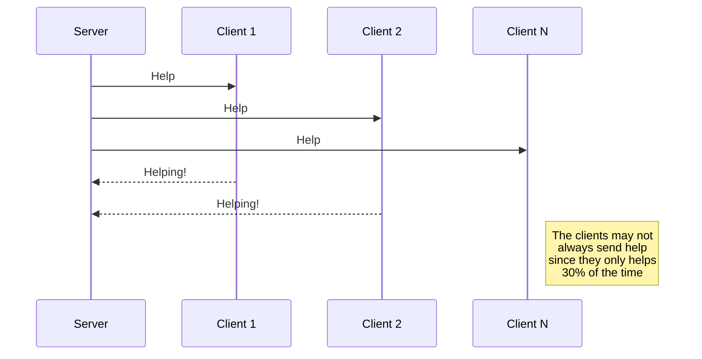

# Práctica 1
## Gestión de múltiples clientes con sockets

### Introducción 
En el siguiente docuemnto explicaré la realización de está práctica, el enfoque que se ha propuesto además de los problemas encontrados y como los he enfrentado.

## Diagrama de eventos


## Explicación del código a alto nivel
### Servidor
```c
Inicialización(){
    ...
}
server_Thread(){
    espera 5 segundos para que se conecten los clientes
    enviar mensaje de ayuda a todos los clientes
}
while (true) {
    aceptar nuevos clientes
    crear un thread para ese cliente
    añadirlo a la cola de clientes
}
```
En el método principal primero inicializamos el servidor con su dirección y puerto además de otras variables. Luego, creamos un hilo en el que el servidor irá pidiendo ayuda a los distintos clientes. Se ha decidido que antes de lanzar este proceso se esperan 5 segundos para que se conecte almenos un cliente. 
Para que el cliente responda solamente al último mensaje se ha intentado (sin éxito) poner un contador con el número de mensaje de ayuda en el cual está el servidor pero he tenido varios problemas con esto ya que el cliente estaba siempre por detrás y no me acabó de funcionar muy bien.


### Cliente
La parte del cliente es mucho más sencilla pues la función más relevante es la que se encarga de enviar mensajes de ayuda al servidor.

```c
int main () {
    conectarse al servidor
    crear un thread para la funcion de enviar mensajes de ayuda
}
```
También tenemos dos funciones adicionales llamadas **send_msg_handler** i **recv_msg_handler** que se encargan de enviar i recibir mensajes respectivamente.

La función encargada de la ayuda se llama **help_handler**
Se quería hacer una implementación en la que cada cliente pudiése enviar solo 1 mensaje de ayuda cada vez que el servidor pide ayuda, es decir, que un solo cliente no pueda ayudar 2 veces. Aunque no se ha logrado debido a diversos problemas, explicaré el enfoqué que seguí. Primero se pensó en terminar el thread del cliente una vez que haya ayudado pero eso no permetiría que ese cliente ayudáse nunca más por eso se introdujeron dos flags llamados **flagReceived** y **flagCanHelp**.
El propósito del primer flag es que el cliente no se quedase bloqueado a la hora de recibir mensajes del servidor ya que el cliente a la hora de dormirse por un tiempo, por ejemplo 5 segundos no duerme solo 5 segundos sino que se queda bloqueado hasta que el servidor envía un mensaje. El propósito del flag **canHelp** es el de poder enviar solo un mensaje en la iteración actual, por ello se había pensado en ponerlo a 1 cuando recibimos un mensaje del servidor y a 0 cuando enviamos un mensaje de ayuda.

## Instrucciones
### Compilar
```console
gcc Server1.c -o server
```
```console
gcc client1.c -o client
```

### Ejecutar
```console
 ./server <PORT>
 ```
```console
 ./client <PORT>
 ```

